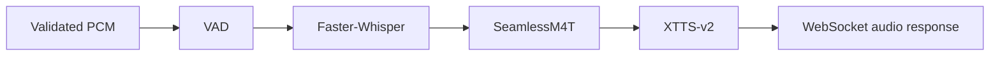

# AI Pipeline

## Status

No AI model packages are installed or loaded. CPU development remains the current supported local mode.

## Planned pipeline

Model loading will be isolated behind service interfaces and moved off the event loop. Model sizes, device selection, and storage paths will be environment-configured.
