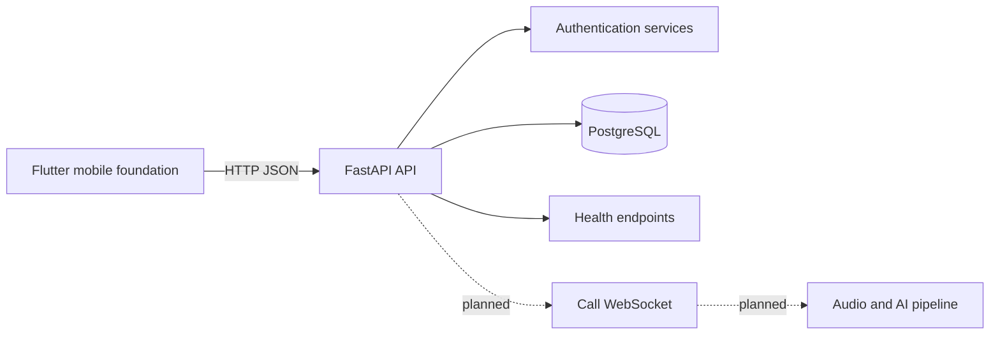

# Architecture

## Current

VoiceTranslate currently has a FastAPI backend with an async SQLAlchemy database layer, Alembic migrations, health endpoints, and authentication routes. The mobile and AI layers are foundations only.

## Implemented

- FastAPI application and CORS middleware.
- PostgreSQL-oriented async SQLAlchemy sessions and Alembic migrations.
- User, call, contact, device, preference, and translation metadata models.
- Registration, login, refresh, logout, and current-user authentication endpoints.
- `/health`, `/health/live`, and `/health/ready`.

## Planned

- Contacts, call lifecycle, and authenticated WebSocket transport.
- Audio validation, buffering, VAD, and AI service adapters.
- Flutter network integration beyond the authentication foundation.
