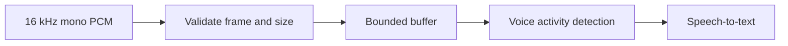

# Audio Pipeline

## Status

Audio processing is not implemented. The current backend does not accept microphone frames and does not store raw recordings.

## Planned pipeline

Planned safeguards include bounded memory, supported-format checks, sample-rate validation, silence filtering, and configurable speech/silence thresholds.
