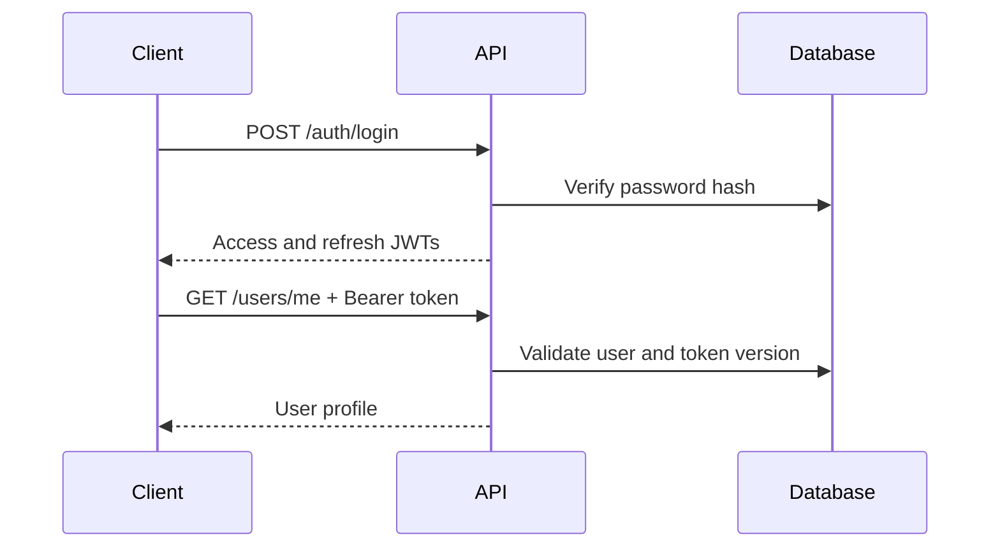

# Authentication

## Implemented

The backend validates email addresses and requires passwords of at least eight characters containing a lowercase letter, uppercase letter, and number. Passwords are hashed with `pwdlib`'s recommended password hasher and are never returned by the API.

Login issues short-lived access tokens and longer-lived refresh tokens signed with the environment-provided `JWT_SECRET_KEY`. Tokens contain a user id, token type, expiration, and token version. Logout increments the user's token version, invalidating existing access and refresh tokens.

## Configuration

Set `JWT_SECRET_KEY` in `.env`; never commit it. The current implementation uses HS256 and configurable access/refresh lifetimes in backend settings.

## Planned

Email verification, password reset, refresh-token rotation, and device/session-specific revocation are not implemented yet.
